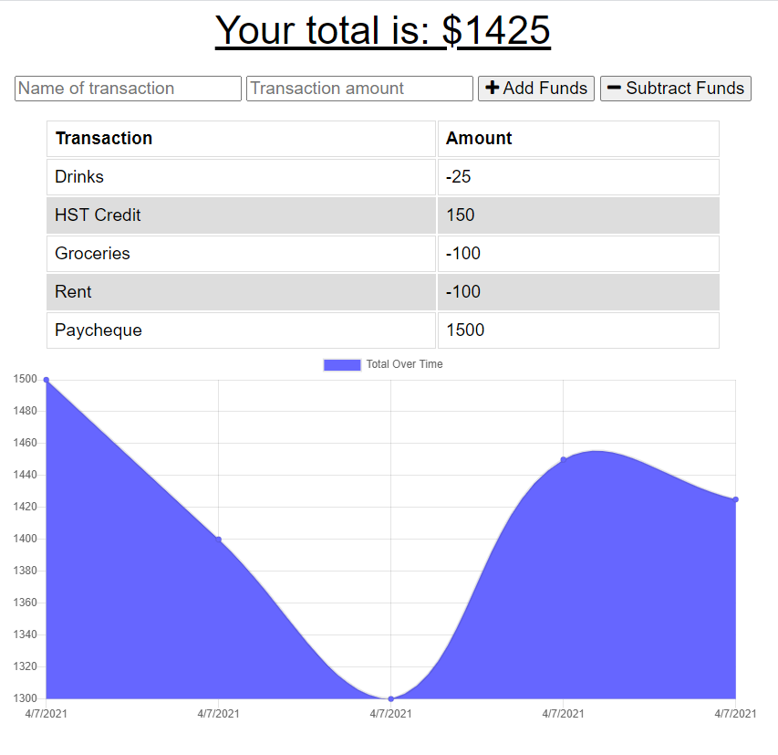

# Online/Offline Budget Tracker

A budget tracker app that uses MongoDB to store and display transactions.

## Description 

* [Github Repository](https://github.com/kirsralk/Offline-Budget).
* [Deployed on Heroku](https://young-mountain-40439.herokuapp.com/).

Budget Tracker allows users to record transactions from anywhere, including while offline.

* App Screenshot:



### User Story

```
AS AN avid traveller 
I WANT to be able to track my withdrawals and deposits with or without a data/internet connection 
SO THAT my account balance is accurate when I am traveling
```

## Installation

This app is deployed on Heroku and can be accessed from your browser at https://young-mountain-40439.herokuapp.com/.

## Credits

Created by Kirsi: https://github.com/kirsralk/


## License

[](https://opensource.org/licenses/MIT)